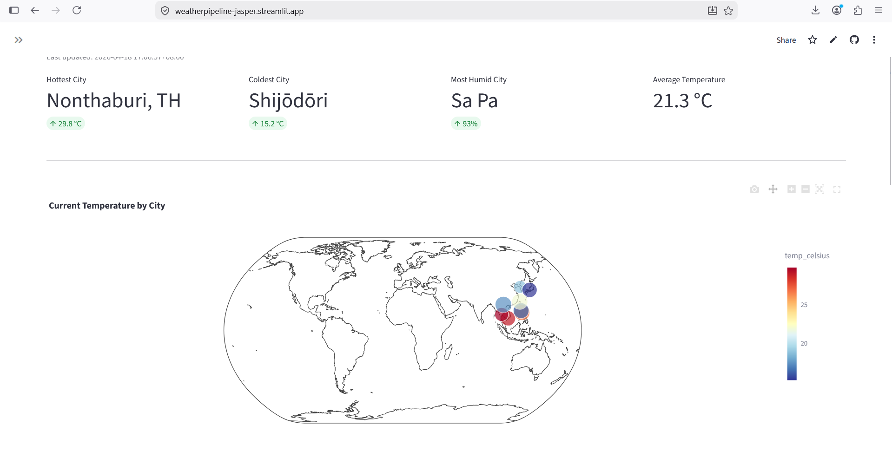

# Weather Data Pipeline

## Overview
An end-to-end data engineering pipeline that collects real-time weather data from 10 cities across Asia and the world, processes and enriches it, stores it in the cloud, and visualizes it through an interactive dashboard. Built as a beginner data engineering portfolio project covering all core DE concepts from ingestion to deployment.

**Live Dashboard:** [https://weatherpipeline-jasper.streamlit.app/]



---

## Architecture

```
OpenWeatherMap API
       ↓
fetch_weather.py (ingestion)
       ↓
raw_data/ (local transformed CSV — bronze layer)
       ↓
run_transformation.py (clean + enrich — silver layer)
       ↓
raw_data/ (local transformed CSV)
       ↓
run_checks.py (data quality gates)
       ↓
supabase_loader.py
       ↓              ↓
   AWS S3         Supabase
 (archive)       (warehouse)
                     ↓
            Streamlit Dashboard
```

---

## Tech Stack

| Layer | Tool | Purpose |
|---|---|---|
| Ingestion | Python + requests | Fetch weather data from API |
| Raw and transformed storage — local | CSV files | Bronze layer archive |
| Raw and transformed storage — cloud | Amazon S3 | Cloud backup of all created files |
| Transformation | pandas | Clean, enrich, and derive new columns |
| Warehouse | Supabase (PostgreSQL) | Cloud database for analytics |
| Orchestration | Apache Airflow | Schedule and monitor the pipeline |
| Data quality | Custom checks | Validate data before loading |
| Dashboard | Streamlit + Plotly | Interactive visualization |
| Auth — AWS | IAM Access Keys | Programmatic AWS access |
| Auth — Supabase | URL + API Key | Supabase client authentication |
| Version control | Git + GitHub | Source control |
| Deployment | Streamlit Cloud + AWS EC2 | Public dashboard + 24/7 pipeline |

---

## Project Structure

```
weather-pipeline/
├── .env                          # Credentials (never committed)
├── .gitignore
├── requirements.txt
├── README.md
│
├── ingestion/
│   ├── __init__.py
│   ├── cities.csv                # 10 target cities with coordinates
│   └── fetch_weather.py          # API ingestion script
│
├── raw_data/                     # Local CSV storage - raw and transformed (gitignored)
│
├── transformation/
│   ├── __init__.py
│   ├── clean.py                  # Null handling, deduplication, type fixing
│   ├── enrich.py                 # Temperature conversion, heat index, datetime parsing
│   └── run_transformation.py     # Coordinator — calls clean then enrich
│
├── loading/
│   ├── __init__.py
│   └── supabase_loader.py        # Upload to S3 and insert into Supabase
│
├── quality/
│   ├── __init__.py
│   └── run_checks.py             # 7 data quality checks
│
├── orchestration/
│   ├── __init__.py
│   ├── start_airflow.sh          # Local WSL startup script
│   ├── in_ec2_server_setup.sh      # EC2 production startup script
│   └── dags/
│       ├── __init__.py
│       └── weather_dag.py        # Airflow DAG definition
│
├── dashboard/
│   ├── __init__.py
│   ├── app.py                    # Streamlit entry point
│   └── queries.py                # Supabase query functions
│
├── logs/                         # Pipeline run logs (gitignored)
│
└── docs/
    ├── architecture.md
    ├── data_dictionary.md
    ├── setup.md
    └── pipeline_phases.md
```

---

## Quick Start

### Prerequisites
- Python 3.11+
- Git/ Github
- WSL (Windows users — required for Airflow)
- AWS account (free tier)
- Supabase account (free)
- OpenWeatherMap API key (free)
- Streamlit (Dashboard app hosting)

### Installation

```bash
# Clone the repository
git clone https://github.com/jaspertot/1_weather_pipeline.git
cd weather-pipeline

# Create virtual environment (utilize WSL)
python3 -m venv .venv
source .venv/bin/activate 

# Install dependencies
pip install -r requirements.txt

# Set up credentials
# Create .env file
# Edit .env with your actual credentials
```

See [docs/setup.md](docs/setup.md) for detailed setup instructions.

---

## Running the Pipeline

### Run each phase manually
```bash
python3 ingestion/fetch_weather.py
python3 transformation/run_transformation.py
python3 quality/run_checks.py
python3 loading/supabase_loader.py
```

### Run with Airflow (local)
```bash
cd orchestration
bash start_airflow.sh
# Open http://{your-wsl-ip}:8080
```

### Run the dashboard
```bash
streamlit run dashboard/app.py
# Opens at http://localhost:8501
```

---

## Pipeline Phases

| Phase | Description |
|---|---|
| 1 — Environment setup | Virtual environment, dependencies, project structure |
| 2 — API setup | OpenWeatherMap account, endpoint exploration |
| 3 — Ingestion | Fetch, flatten, clean, and save raw weather data |
| 4 — Cloud setup | AWS S3 bucket, Supabase project and tables |
| 5 — Transformation | Temperature conversion, heat index, datetime parsing |
| 6 — Loading | Upload to S3, insert into Supabase |
| 7 — Data quality | Validation checks before every load |
| 8 — Orchestration | Airflow DAG with hourly schedule |
| 9 — Dashboard | Streamlit dashboard with Plotly charts |
| 10 — Deployment | Streamlit Cloud + AWS EC2 |
| 11 — Documentation | README, data dictionary, setup guide |

---

## Cities Monitored

| City | Country |
|---|---|
| Sagada | Philippines |
| Sa Pa | Vietnam |
| Taipei | Taiwan |
| Nonthaburi | Thailand |
| Seoul | South Korea |
| Can Giuoc | Vietnam |
| Baguio City | Philippines |
| Dingalan | Philippines |
| Shijōdōri | Japan |
| Atok | Philippines |

---

## Data Dictionary

See [docs/data_dictionary.md](docs/data_dictionary.md) for full column definitions.

---

## Author

**Jasper Riley Casile**\
*Tech Specialist*
- GitHub: [https://github.com/jaspertot]
- LinkedIn: [https://www.linkedin.com/in/jasper-casile-587488273/]

---